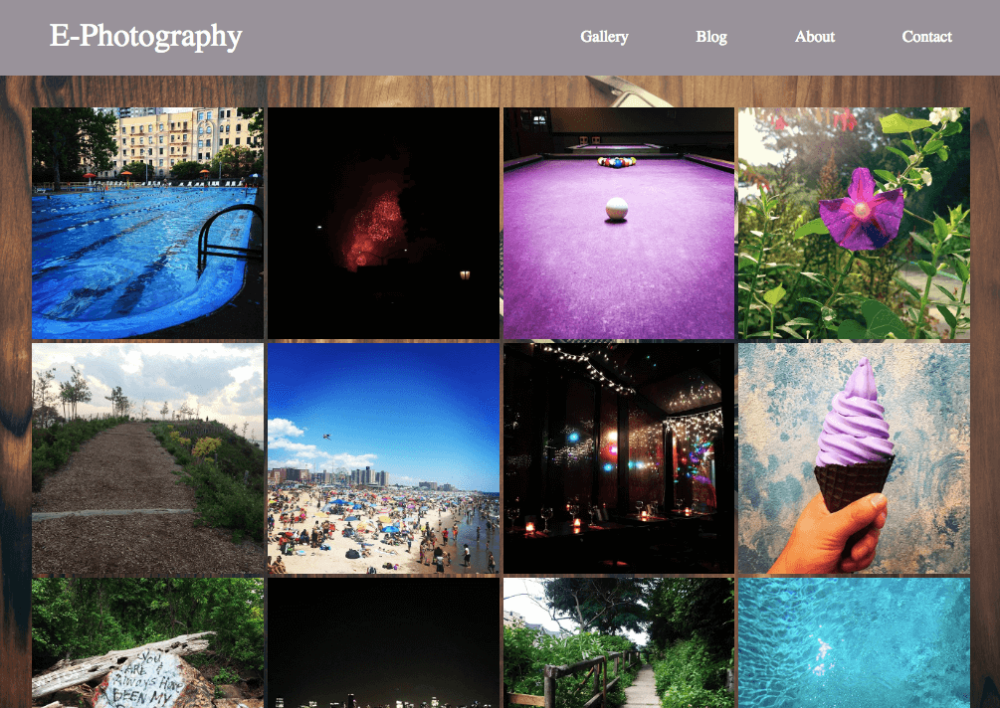

# ePhotography
Fake photography site with images from my instagram. Created so that I could aesthetically display my favourite pictures from my instagram and to master CSS Grid and Flexbox, as well as advance my CSS skills. Plan to expand upon this in the future to a fully fledge photography blog, complete with a Node.js and Express backend with a MongoDB database. Perhaps add some React as well?.. Could be seen on [codepen.io](https://codepen.io/ej-sanmartin/pen/XBZrOZ)

